# **Colwyn Bay Hwb**
## **Site Overview**
The Colwyn Bay Community Hwb and Foodbank is a new community space open 7 days a week, 52 days a year. It is a project in its early stages but has already made progress in developing services and opportunities for local people. However, as with most new ventures, publicity can be difficult to achieve - especially with limited charitable resources available. This website serves as a source of key information for current and new users of the Hwb. It is intended to be a well designed and easy to use lightweight publicity platform and portal.

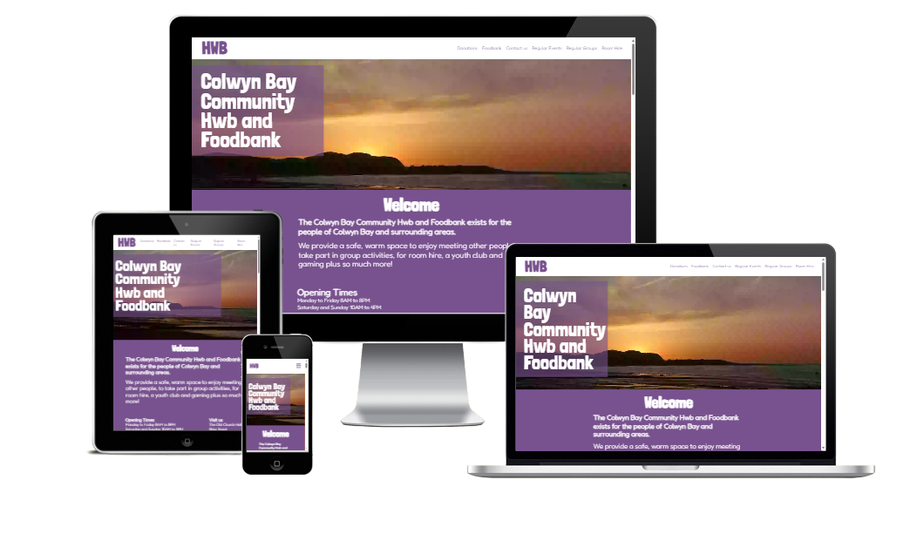

## Table of contents:

## **Planning stage**
### **Target Audiences:**
- People who want to discover general information about the Hwb.
- People who want to find out how to donate to the organisation.
- People who want to make use of the Hwb's foodbank.
- People who need to hire a room.
- People who want to find out what events are coming up or which groups are in regular attendance at the Hwb.

### **User Stories:**
- As a general user of the Hwb's website, I want the website to be easy to navigate, so that I can find the information that I want quickly.
- As someone who hasn't visited the Hwb before, I want to feel that I know more about the Hwb after leaving the website than I did before visiting, so that I can visit the Hwb in person and know when it is open.
- As someone who needs to use the foodbank, I need to know where it is and its opening times, so that I can access it.
- As an event organiser, I want to know basic information about room hire, so that I can make a decision about making a booking.
- As a general user of the Hwb's website, I want to be able to easily contact the Hwb from the website, so that I can enquire about the Hwb's variety of services.
- As an event attendee, I want to learn about upcoming events, so that I can decide if I want to attend.
- As a potential donor, I want to be able to learn how the Hwb accepts donations, so that I can decide how to donate.
  
### **Site Aims:**
- To inform people about the Hwb's aims and purpose.
- To inform people about the Hwb's services and how they can visit.
- To provide details about donating.
- To provide a method of communication with the Hwb.
- To provide event and group organisers with a means of publicising their events and groups.

### **How this will be achieved:**
- The home page provides users with a brief introduction to the Hwb, the opening times and the location.
- The home page contains the latest news section and information on how to use the foodbank and donate, as well as the contact form.
- There is a sticky navigation bar that provides access to the remaining pages.
- A link to the Hwb's social media account is in the footer.
- There is a page that provides basic details about upcoming events and regular group bookings. There is a section in this page that provides information regarding room hire and a link to the contact page to enquire.

### **Wireframes:**
To help provide design consistency and to ensure a more streamlined approach to development, I've created two sets of wireframes: one for desktop and another for mobile. Links to each of the wireframes can be found below.
To improve the user experience (UX), there have been some changes to the design after the wireframes were created.
- The form's _thank you_ page is now a modal - this means less tab switching/page navigation.
- The main textual content is now left-aligned rather than center align - this gives a better visual appearance and improves readability.
- The 404 page no longer uses the header/footer layout but presents a cleaner display of the error and the way back home.
- There has also been some minor changes to some of the subsection placements to aid responsiveness.

* Mobile Wireframes:
    * [Landing Page](docs/wireframes/resized/mobile-landing-page.png)
    * [Error 404 Page](docs/wireframes/mobile-404-page.png)
    * [Contact Thank You Page](docs/wireframes/mobile-contact-thankyou-page.png)
    * [Events and Group Details Page](docs/wireframes/mobile-events-groups-details-page.png)

* Desktop wireframes:
    * [Home Page](docs/wireframes/desktop-landing-page.png)
    * [Error 404 Page](docs/wireframes/desktop-404-page.png)
    * [Contact Thank You Page](docs/wireframes/desktop-contact-thankyou-page.png)
    * [Events and Group Details Page](docs/wireframes/desktop-events-groups-details-page.png)

### **Colour Scheme:**
I chose hues of purple and orange based on some of the colours found within the Hwb's logo. Black and white text complement these colours. When using Google Dev Tools' Lighthouse feature I discovered that the text/background colour contrast was too low with the chosen purple hue so I used a [suggested tool](https://dequeuniversity.com/rules/axe/4.10/color-contrast) to adjust the contrast ratio. This means that the purple deviates from the original selection (#936FAC). The value found in the CSS styles is now #77528E.
The logo doesn't lend itself well to being used within the typical navigation bar so I've opted for a cleaner logotype text instead.
#### Original Logo
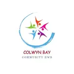

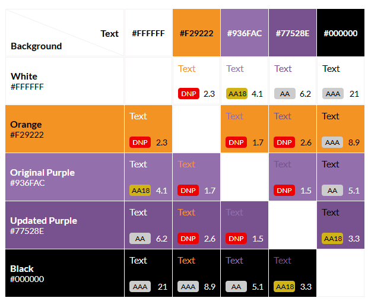 

## **Structure**
###  **Header Element**
The header element floats at the top of the page so that the menu is always accessible to the user.
#### *Logotype Text and Home Link:*
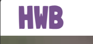

The title provides a handy reminder of the site that the user is visiting as well as a helpful 'back home' link to the landing page.

#### *Navigation Bar:*

The nav bar provides the user with links to each of the main sections on the landing page and the events/groups page. 
The links provide feedback and become bold when the user brings one of these sections into the view of the browser window.
***
### **Hero Images**
There is only one hero image. This helps create a sense of uniformity in the pages that the user visits, reducing distractions from the page contents.
The image is that of the Colwyn Bay coast where the Hwb is located and has been borrowed from the tourism website, NorthWales.com.
The image is responsive across the various standard viewport sizes and stays consistent across each.

The page title rests on top of this hero image - it is bright and clear.

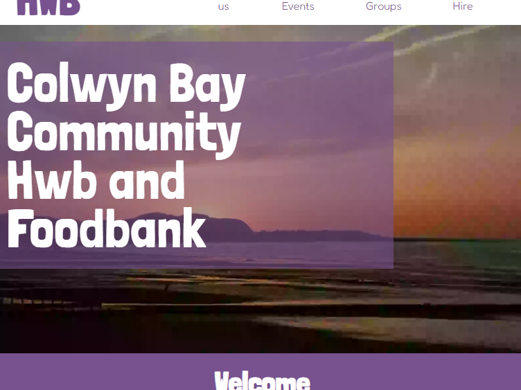

### **Pages and Sections**:
There are currently two pages: the landing (home) page and an Events and Regular Groups page.

Each page is split into logical sections of information. They are each given a background colour that switches between
an orange and a purple depending on their position in the pattern.
Each section is split with a horizontal rule that also acts as an anchor point for navigation, making each section of information
clearer for the user.

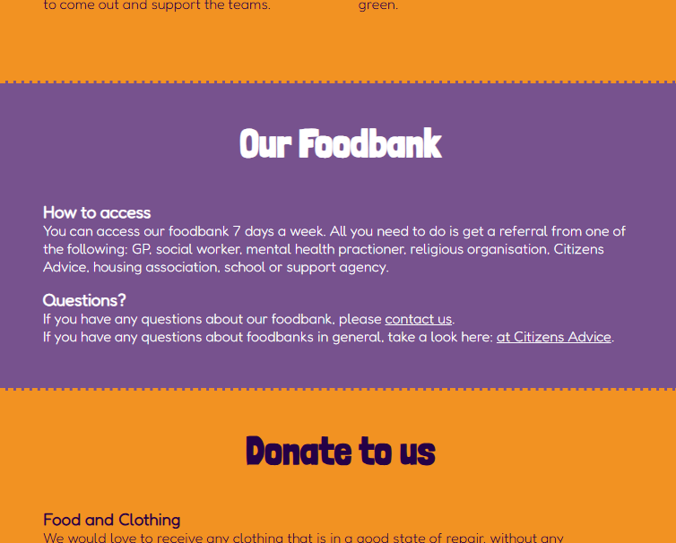

### **Footer**

This footer is present on each page. There's an imprint from the designer/developer. There is a social link to the Hwb's
Facebook page for users who are on Facebook. The footer's background matches that of the purple found in the overall theme. It is intended
that the footer would match the background colour of the final section for each page.

## Features

### **Anchor tags within main content**
Anchor tags have been left with the underline text decoration to facilitate users finding appropriate links.
The anchor text colour is to match the specific theme of the particular section or area of a page that the anchor sits within.
For example, in a section with a purple background the anchor text will match with the white colour text. If the section is orange, 
the anchor text will match the deep purple text colour.

### **Landing Page:**
The landing page contains the following sections:
- Welcome including Opening Times and location
- A carousel of images
- Latest News
- Foodbank information
- Donations information
- A contact form with modal

#### *Welcome*
The Welcome section provides basic information about the Hwb along with opening times and the Hwb's location.

#### *Carousel*
The image carousel showcases to the user some of the events and activities that take plan around the Hwb. The carousel is operated
by using the 'left' and 'right' arrow buttons located either side of the carousel feature.

#### *Latest News*
The Latest News section provides the user with important and exciting updates that the Hwb and its people would like to share.
The news is presented in a card format. The cards are responsive for different viewport sizes and presents more or less
cards to fit the screen.

#### *Foodbank information*
The Foodbank section gives general information to the user about how to access the foodbank and signposts the user to 
the contact form for further information or questions.

#### *Donations information*
The donations section presents high level information about the types of donations that the Hwb can accept
and how people can provide them with signposting links to the contact form for more information.

#### *Contact form with modal and validation*
The contact form is at the bottom of the landing page but can be accessed via links throughout the landing page or the 
events and groups page, as well as the navigation menu. When the user submits the form the input is validated and any error messages
are displayed to the user underneath the relevant input. Once the form has all the required information a modal
appears to the user as a confirmation screen.

#### Validation
The form's validation appears as error messages under the various input boxes depending on what is or is not provided
when the send button is pressed.

#### Modal
The modal appears once the send button is pressed. When the modal appears the body of the page behind the modal 
is blurred - this helps to increase the contrast between the page and the modal and also suggests to the user that the form behind it
is no longer accepting input. There is an 'x close' clickable span where users would typically expect a button to exist to close the modal.
Once the modal is closed the form inputs are reset and the page body has its blur removed.

### **Events and Regular Groups Page**
The Events and Regular Groups page contains the following sections:
- Events
- Regular Groups
- Room hire information

Each of these sections provides the user with distinct information about the Hwb's activities.
The Events and Regular Groups sections share a similar card-based design to the Latest News section on the landing page.
It is hoped that this consistency would promote a sense of cohesiveness and professionalism to the user with a title,#
image and detail parts to the cards.

Both the Events and Regular Groups sections are responsive. The amount of cards per column and row
adapts depending on the user's viewport width. This ensures that the user's screen isn't overloaded with information, but
offers an attractive design.

### **Room hire** ###
The Room Hire section provides the user with basic information about which rooms are available for hire.
There is also a link to the contact form to enquire about booking.

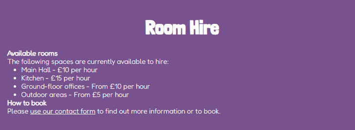

## **Future Enhancements**
This website has the potential for various new features and enhancements. I have written them below in the form of user stories for clarity.

*Financial donation payments*:

As a user, 
I would like a easily accessible widget
so that I can make easy and secure financial donations.

*Events calendar*:

As a user, I would like a calendar so that I can easily find out what events are occurring on specific dates.

*Room hire booking app*:
As a user, I would like an app that accepts room bookings so that I can book a room at my convenience.

*Content Management System*: As the site owner, I would like a system for creating and updating content, so that I can maintain the website and keep it up to date.

***

## **Typography**
The fonts used have been selected and imported from Google.
- Londrina Solid: for all main headings and the logotype in the header navbar
- Fredoka: for all other text including links and navbar text

***
## **Testing Phase**
During the development process, I have manually tested as well as used various automated testing tools.

I have manually testing each element for appearance and responsiveness via a simulated live server using Python's integrated web server.

I have published the page via GitHub pages and shared with fellow peers, friends and family to test and received feedback.

During testing, I used five different browsers to ensure cross-compatibility.

*Desktop browsers*

- Chrome
- Firefox
- Opera
- Edge
- Brave
- Safari

I have also used the Chrome DevTools to simulate different screen sizes/devices from 320 px up to 4000px in width.

## Bugs and Fixes:
Below is a list of bugs I found during the development process by testing myself via the live server extension on VSCode. I tried each element for how the browser would display the page to potential users on a range of different screen widths from 320px to 4000px:-

1. Expected behaviour: Carousel images to display responsively for mobile devices
   - **Actual behaviour**: Carousel images not displaying correctly on mobile
   - **Fix**: I had to adjust the image size and the carousel container size to ensure that the images were displayed correctly on mobile devices.
2. Expected behaviour: Carousel images to display responsively for desktop devices
   - **Actual behaviour**: Carousel images not displaying correctly on desktop**:
   - **Fix**: I had to adjust the image size and the carousel container size to ensure that the images were displayed correctly on desktop devices.
3. Expected behaviour: Carousel images to display responsively for tablet devices
   - **Actual behaviour**: Carousel images not displaying correctly on tablet:
   - **Fix**: I had to adjust the image size and the carousel container size to ensure that the images were displayed correctly on tablet devices.
4. Expected behaviour:
   - **Actual behaviour**: Contact form HTML validation rules no applying
   - **Fix**: Create a set of JavaScript rules to check for input in the form fields and to provide feedback to the user.
5. **Expected behaviour**: If an invalid email address is entered in the email input in the contact form the form does not submit.
   - **Actual behaviour**: The form submits.
   - **Fix**: Add a JavaScript function with a regex pattern to check the input as part of the input validation rules.
6. **Expected behaviour**: When the user scrolls to certain sections within the website the navigation bar highlights the appropriate section.
   - **Actual behaviour**: The navigation bar does not highlight the appropriate section correctly.
   - **Fix**: Add a JavaScript function that looks for a custom *data-nav* attribute on horizontal rule elements to check
   the user's scroll position. This then applies the correct styling to the navigation bar.
7. **Expected behaviour**: The hero image and text overlay should responsively change size in a consistent way depending on the user's viewport.
   - **Actual behaviour**: The hero image and text changes size inconsistently.
   - **Fix**: Set the parent hero element's height as a 50% proportion of the view height.#
8. **Expected behaviour**: The navigation bar links are highlighted and stay highlighted for the correct section when scrolling.
   - **Actual behaviour**: The navigation bar links are highlighted but in some cases the active class is misapplied when scrolling.
   - **Fix**: Remove distance.top from the JavaScript logic - this would always show true.

## Post Development Testing
Various actions were taken to improve the website's performance and accessibility.

These include:

- Resizing images to improve responsiveness
- Optimising images and converting to webp format where possible
- Ensuring JavaScript and CSS import tags are correctly located in the HTML
- Prefetching and preloading resources - reducing the time it takes to load the page
- Using inline CSS to load the hero image on each page to reduce the page rendering time
- Using SVG images instead of fetching Font Awesome icons - reducing the number of web requests

Some minor issues remain such as the loading of Google Fonts - this is outside my control.
Further image optimisation could be considered to improve rendering speed for mobile devices. 
The server responsiveness of GitHub Pages also impacts the scoring to varying degrees depending on 
global usage, again, this is outside my control. If the website were to be handed-over to the Hwb it would 
need to be hosted on a dedicated server for better performance.

I have used the following tools to test the website for accessibility and performance.

### Google Chrome DevTools Lighthouse
*Local Development Server: Landing Page (Mobile)*
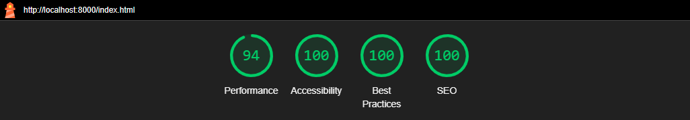

*Local Development Server: Events and Groups Page (Mobile)*
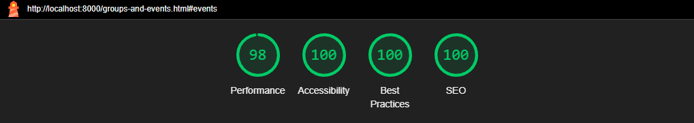

*Local Development Server: Landing Page (Desktop)*
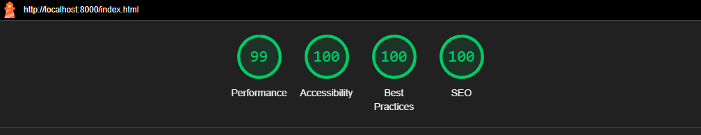

*Local Development Server: Events and Groups Page (Desktop)*
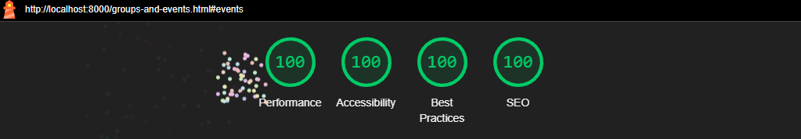

*GitHub Pages: Landing Page (Mobile)*
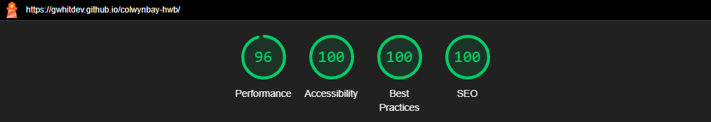

*GitHub Pages: Events and Groups Page (Mobile)*
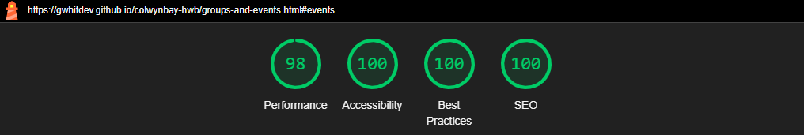

*GitHub Pages: Landing Page (Desktop)*
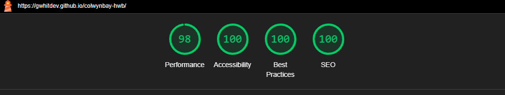

*GitHub Pages: Events and Groups Page (Desktop)*
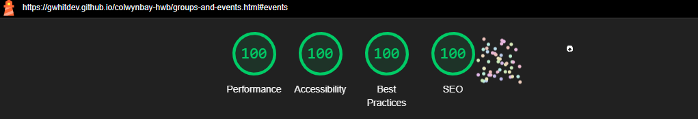

### [W3C Markup Validation Service](https://validator.w3.org/nu/)
Both index.html and groups-and-events.html have been validated without any errors or warnings.

### [W3C CSS Validation Service (JigSaw)](https://jigsaw.w3.org/css-validator/)
I used the W3C CSS validator to check the stylesheets that I have created.

Each of the stylesheets passed validation with no errors or warnings except that CSS variables cannot be statically checked.

***Deployed index.html***

***Deployed groups-and-events.html***

### WAVE - Web Accessibility Evaluation Tool
I have tested all the website's pages for accessibility using the WAVE evaluation tool. The only error that was shown was
related to the nav toggle button not having a label. This is because the button is an SVG icon (image). After researching,
I learned of the 'role' attribute that can be used to provide a label for the button with an additional aria-label.
I have added this to the SVG icon across the site.

The tool now shows no errors or warnings.

*Landing Page*:
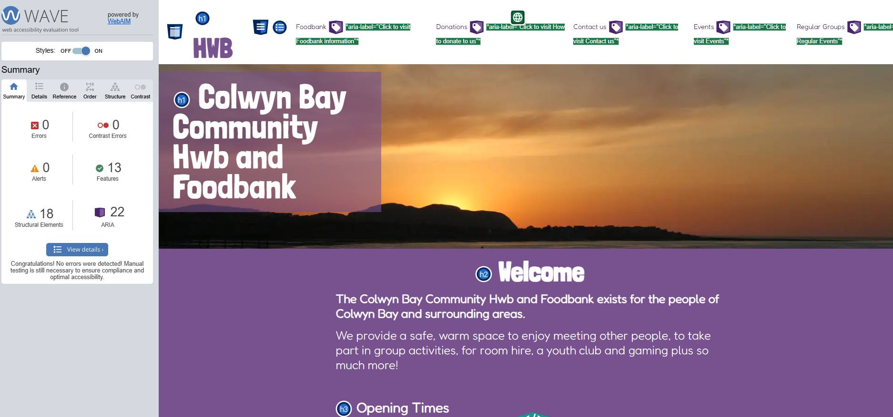

*Events and Regular Groups Page*:
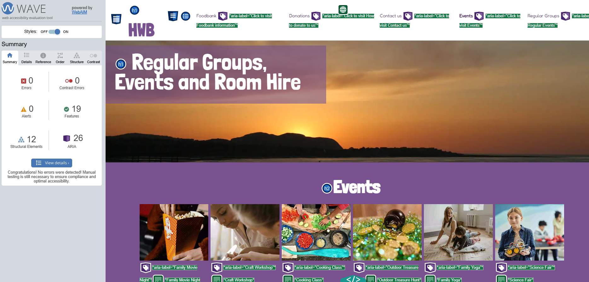

***
## **Deployment**
I deployed the page on GitHub pages via the following procedure:

1. Navigate to the GitHub repository.
2. Go to the Settings tab.
3. From the left-hand menu, select the Pages tab.
4. Under the Build and Deployment section and then the Source section, select the Main branch from the drop-down menu and click Save.
5. A message will be displayed to indicate that the deployment to GitHub Pages has been successful.

You can find the live site via the following URL: [Colwyn Bay Hwb](https://gwhitdev.github.io/colwynbay-hwb/)

***
## **Credits**

### **Content:**
* Icons were borrowed from [Font Awesome](https://fontawesome.com)
* All fonts imported from - [Google Fonts](https://fonts.google.com/)
  
### Stock Images
*Latest News*
- Local Park Renovation Project Completed: Photo by Kampus Production: https://www.pexels.com/photo/food-on-the-picnic-blanket-7669122/
- Community Garden Initiative Blossoms: Photo by Kampus Production: https://www.pexels.com/photo/smiling-woman-harvesting-lettuce-7658794/
- Annual Charity Run Raises Record Funds: Photo by RUN 4 FFWPU: https://www.pexels.com/photo/girl-wearing-red-and-yellow-top-running-2168291/
- New Art Exhibit Showcases Local Talent: Photo by ¶Project Atlas: https://www.pexels.com/photo/three-paintings-hanging-in-gallery-1674049/
- Youth Sports League Kicks Off Season: Photo by Laura Rincón: https://www.pexels.com/photo/women-s-soccer-match-on-a-sunny-day-outdoors-30199725/
- Community Clean-Up Day a Huge Success: Photo by Ron Lach : https://www.pexels.com/photo/man-and-woman-holding-hands-while-walking-on-forest-9543405/
- 

*Events*
- Family Movie Night Event - Photo by Tima Miroshnichenko: https://www.pexels.com/photo/hand-getting-popcorn-in-yellow-tumbler-7991531/
- Craft Workshop: Photo by cottonbro studio: https://www.pexels.com/photo/two-women-making-a-sculpture-6694743/
- Cooking Class: Photo by Maarten van den Heuvel: https://www.pexels.com/photo/person-holding-sliced-vegetable-2284166/
- Outdoor Treasure Hunt: Photo by RDNE Stock project: https://www.pexels.com/photo/st-patrick-s-day-props-in-tilt-shift-lens-7080498/
- Science Fair: Photo by Vanessa Loring: https://www.pexels.com/photo/a-girl-in-plaid-long-sleeves-holding-battery-operated-toy-7869079/
- Family Yoga: Photo by Valeria Ushakova: https://www.pexels.com/photo/woman-wearing-white-sleeveless-top-3094230/
- Story telling: Photo by Lina Kivaka: https://www.pexels.com/photo/woman-reading-book-to-toddler-1741231/
- Board Game Tournament: Photo by Tima Miroshnichenko: https://www.pexels.com/photo/light-hands-people-table-6598746/
- Picnic in the park: Photo by Helena Lopes: https://www.pexels.com/photo/group-of-people-sitting-on-white-mat-on-grass-field-745045/
- Music Concert: Photo by Martin Lopez: https://www.pexels.com/photo/smiling-man-standing-and-dancing-near-smiling-woman-surrounded-with-people-2240771/
- Holiday Craft Fair: Photo by cottonbro studio: https://www.pexels.com/photo/two-women-making-a-sculpture-6694743/
- Family Dance Party: Photo by Ralph Bossingham: https://www.pexels.com/photo/a-girl-surrounded-by-confetti-15661565/

*Groups*
- Yoga for beginners: Photo by Mel Audelo: https://www.pexels.com/photo/women-practicing-yoga-indoors-for-wellness-28558808/
- Book Club: Photo by Helena Lopes: https://www.pexels.com/photo/group-of-people-reading-book-sitting-on-chair-711009/
- Art and Craft Workshop: Photo by Antoni Shkraba: https://www.pexels.com/photo/a-woman-painting-on-a-canvas-4442005/
- Cooking Class: Photo by cottonbro studio: https://www.pexels.com/photo/men-standing-near-a-table-full-of-vegetables-6822587/
- Tech Help Drop-in: Photo by Marcus Aurelius: https://www.pexels.com/photo/woman-in-red-blazer-sitting-by-the-table-having-a-meeting-4063791/

*Carousel*
- Images taken from the Hwb's Facebook page

*Tools*
- Images requiring compression were done using: [tiny.png](https://tinypng.com)
- Screenshot under README.md section titled "site overview" was created with [Am I responsive](https://ui.dev/amiresponsive?url=https://gwhitdev.github.io/colwynbay-hwb/)
- Colour grid contract tool: [Eightshapes](https://contrast-grid.eightshapes.com/)
- Image Lint used to check responsive image: [Image Lint](https://imagelint.com/)
- GitHub ImageBot was also used to optimise some images.

### Other:
- Original inspiration for the carousel feature: [W3Schools](https://www.w3schools.com/howto/howto_js_slideshow.asp)

### Thank you

- [Richard Wells](https://github.com/D0nni387) - Code Institute Mentor who has gone above and beyond what was expected of him to help me get this far in the course.
- Fellow students on the Code Institute course who have provided feedback and support.

