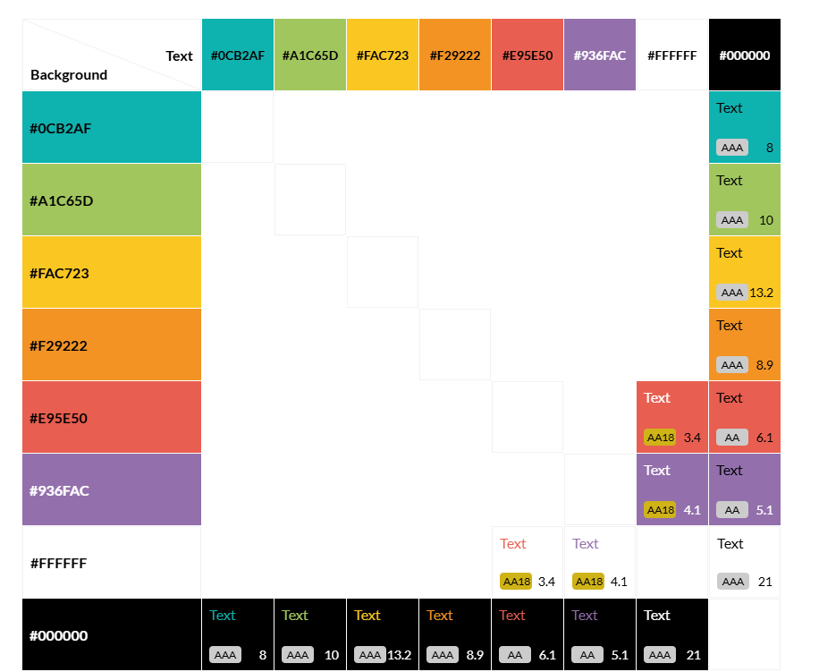

# **Colwyn Bay Hwb**
## **Site Overview**
The Colwyn Bay Community Hwb and Foodbank is a new community space open 7 days a week, 52 days a year. It is a project in its early stages but has already made progress in developing services and opportunities for local people. However, as with most new ventures, publicity can be difficult to achieve - especially with limited charitable resources available. This website serves as a source of key information for current and new users of the Hwb. It is intended to be a well designed and easy to use lightweight publicity platform and portal.

## Table of contents:
1. [**Site Overview**](#site-overview)
1. [**Planning stage**](#planning-stage)
    * [***Target Audiences***](#target-audiences)
    * [***User Stories***](#user-stories)
    * [***Site Aims***](#site-aims)
    * [***How Is This Will Be Achieved:***](#how-is-this-will-be-achieved)
    * [***Wireframes***](#wireframes)
    * [***Color Scheme***](#color-scheme)
1. [**Current Features Common to all pages**](#current-features-common-to-all-pages)
    * [***Header Element:***](#header-element)
        * [*Title*](#title)
        * [*Navigation Bar*](#navigation-bar)
    * [**Hero Images:**](#hero-images)
      * [***About Page***:](#about-page)
          * [*Hero-Image*](#hero-image)
          * [*Quote*](#quote)
      * [***Contact and Form Thank You pages:***](#contact-and-form-feedback-pages)
          * [*Hero-Image*](#hero-image-3)
          * [*Quote*](#quote-3)
    * [**Anchor Tags Within all Pages Main Content**](#anchor-tags-within-all-pages-main-content)
    * [**Footer**](#footer)
    * [**Typography**](#typography)
1. [**Individual Page Content features**](#individual-page-content-features)
    * [**About Page Content**](#about-page-content)
    * [**Teachings Page Content**](#teachings-page-content)
    * [**Community Page Content**](#community-page-content)
    * [**Contact Page Content**](#contact-page-content)
    * [**Form Thank You Page Content**](#form-feedback-page-content)
1. [**Miscellaneous Pages**](#miscellanous-pages)
1. [**Future-Enhancements**](#future-enhancements)
1. [**Testing Phase**](#testing-phase)
1. [**Deployment**](#deployment)
1. [**Credits**](#credits)
    * [**Honorable mentions**](#honorable-mentions)
    * [**General reference**](#general-reference)
    * [**Content**](#content)
    * [**Media**](#media)

## **Planning stage**
### **Target Audiences:**
- People who want to discover general information about the Hwb.
- People who want to find out how to donate to the organisation.
- People who want to make use of the Hwb's foodbank.
- People who need to hire a room.
- People who want to find out what events are coming up or which groups are in regular attendance at the Hwb.

### **User Stories:**
- As a general user of the Hwb's website, I want the website to be well designed and easy to navigate, so that I can find the information that I want quickly.
- As someone who hasn't visited the Hwb before, I want to feel that I know more about the Hwb after leaving the website than I did before visiting, so that I can visit the Hwb in person and know when it is open.
- As someone who needs to use the foodbank, I need to know where it is and its opening times, so that I can access it.
- As an event organiser, I want to know basic information about room hire, so that I can make a decision about making a booking.
- As a general user of the Hwb's website, I want to be able to easily contact the Hwb from the website, so that I can enquire about the Hwb's variety of services.
- As an event attendee, I want to learn about upcoming events, so that I can decide if I want to attend.
- As a potential donor, I want to be able to learn how the Hwb accepts donations, so that I can decide how to donate.
  
### **Site Aims:**
- To inform people about the Hwb's aims and purpose.
- To inform people about the Hwb's services and how they can visit.
- To provide details about donating.
- To provide a method of communication with the Hwb.
- To provide event and group organisers with a means of publicising their events and groups.

### **How this will be achieved:**

### **Wireframes:**

* Mobile Wireframes:
    * [Home Page](docs/wireframes/landing-mobile-wireframe.png)
    * [Error 404 Page](docs/wireframes/mobile-404-page.png)

* Desktop wireframes:
    * [Home Page](docs/wireframes/desktop-landing-page.png)
    * [Error 404 Page](docs/wireframes/desktop-404-page.png)

### **Color Scheme:**
I have removed the colour groups that do not pass at least the grade of AA18 from the grid below.

## **Current Features Common to all pages**
###  **Header Element**

#### *Title:*

#### *Navigation Bar:*

***
### **Hero Images**

### **About Page**:

### **Contact and Form Feedback pages:**

## **Anchor Tags Within all Pages Main Content**

## **Footer**

## **Typography**

## **Individual Page Content features**
### **About Page Content:**

### **Contact Page Content**

## **Future Enhancements**
## **Miscellanous Pages**

***
## **Testing Phase**

***
## **Deployment**

***
## **Credits**
### **Thank yous**

* [Richard Wells](https://github.com/D0nni387) - Code Institute Mentor who has gone above and beyond what was expected of him to help me get this far in the course.

### **References:**

### **Content:**
* Icons were borrowed from [Font Awesome](https://fontawesome.com)
* The golden gradient colour scheme - [brandgradients.com](http://www.brandgradients.com/gold-gradient).
* All fonts imported from - [Google Fonts](https://fonts.google.com/)
* Accessibility checker - [WAVE - Web accessibility evaluation tool](https://wave.webaim.org/)
  
### **Media:**

* Images requiring compression were done using - [tiny.png](https://tinypng.com) 

* Screenshot under README.md section titled "site overview" was created view [Am I responsive](https://ui.dev/amiresponsive?url=https://gwhitdev.github.io/colwynbay-hwb/)

* Color grid contract tool - [Eightshapes](https://contrast-grid.eightshapes.com/) 

* Calculator used to resize figure images -[Aspect Ratio Calculator](https://andrew.hedges.name/experiments/aspect_ratio/)

### **Other*:*
* Original inspiration for the carousel feature: [W3Schools](https://www.w3schools.com/howto/howto_js_slideshow.asp)

