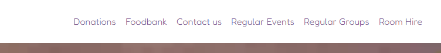
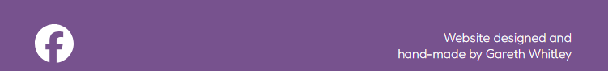

# **Colwyn Bay Hwb**
## **Site Overview**
The Colwyn Bay Community Hwb and Foodbank is a new community space open 7 days a week, 52 days a year. It is a project in its early stages but has already made progress in developing services and opportunities for local people. However, as with most new ventures, publicity can be difficult to achieve - especially with limited charitable resources available. This website serves as a source of key information for current and new users of the Hwb. It is intended to be a well designed and easy to use lightweight publicity platform and portal.

## Table of contents:
1. [**Site Overview**](#site-overview)
1. [**Planning stage**](#planning-stage)
    * [***Target Audiences***](#target-audiences)
    * [***User Stories***](#user-stories)
    * [***Site Aims***](#site-aims)
    * [***How Is This Will Be Achieved:***](#how-is-this-will-be-achieved)
    * [***Wireframes***](#wireframes)
    * [***Colour Scheme***](#Colour-scheme)
1. [**Current Features Common to all pages**](#current-features-common-to-all-pages)
    * [***Header Element:***](#header-element)
        * [*Title*](#title)
        * [*Navigation Bar*](#navigation-bar)
    * [**Hero Images:**](#hero-images)
      * [***About Page***:](#about-page)
          * [*Hero-Image*](#hero-image)
          * [*Quote*](#quote)
      * [***Contact and Form Thank You pages:***](#contact-and-form-feedback-pages)
          * [*Hero-Image*](#hero-image-3)
          * [*Quote*](#quote-3)
    * [**Anchor Tags Within all Pages Main Content**](#anchor-tags-within-all-pages-main-content)
    * [**Footer**](#footer)
    * [**Typography**](#typography)
1. [**Individual Page Content features**](#individual-page-content-features)
    * [**About Page Content**](#about-page-content)
    * [**Teachings Page Content**](#teachings-page-content)
    * [**Community Page Content**](#community-page-content)
    * [**Contact Page Content**](#contact-page-content)
    * [**Form Thank You Page Content**](#form-feedback-page-content)
1. [**Miscellaneous Pages**](#miscellanous-pages)
1. [**Future-Enhancements**](#future-enhancements)
1. [**Testing Phase**](#testing-phase)
1. [**Deployment**](#deployment)
1. [**Credits**](#credits)
    * [**Honorable mentions**](#honorable-mentions)
    * [**General reference**](#general-reference)
    * [**Content**](#content)
    * [**Media**](#media)

## **Planning stage**
### **Target Audiences:**
- People who want to discover general information about the Hwb.
- People who want to find out how to donate to the organisation.
- People who want to make use of the Hwb's foodbank.
- People who need to hire a room.
- People who want to find out what events are coming up or which groups are in regular attendance at the Hwb.

### **User Stories:**
- As a general user of the Hwb's website, I want the website to be well designed and easy to navigate, so that I can find the information that I want quickly.
- As someone who hasn't visited the Hwb before, I want to feel that I know more about the Hwb after leaving the website than I did before visiting, so that I can visit the Hwb in person and know when it is open.
- As someone who needs to use the foodbank, I need to know where it is and its opening times, so that I can access it.
- As an event organiser, I want to know basic information about room hire, so that I can make a decision about making a booking.
- As a general user of the Hwb's website, I want to be able to easily contact the Hwb from the website, so that I can enquire about the Hwb's variety of services.
- As an event attendee, I want to learn about upcoming events, so that I can decide if I want to attend.
- As a potential donor, I want to be able to learn how the Hwb accepts donations, so that I can decide how to donate.
  
### **Site Aims:**
- To inform people about the Hwb's aims and purpose.
- To inform people about the Hwb's services and how they can visit.
- To provide details about donating.
- To provide a method of communication with the Hwb.
- To provide event and group organisers with a means of publicising their events and groups.

### **How this will be achieved:**
- The home page provides users with a brief introduction to the Hwb, the opening times and the location.
- The home page contains the latest news section and information on how to use the foodbank and donate, as well as the contact form.
- There is a sticky navigation bar that provides access to the remaining pages.
- A link to the Hwb's social media account is in the footer.
- There is a page that provides basic details about upcoming events and regular group bookings. There is a section in this page that provides information regarding room hire and a link to the contact page to enquire.

### **Wireframes:**
To help provide design consistency and to ensure a more streamlined approach to development, I've created two sets of wireframes: one for desktop and another for mobile. Links to each of the wireframes can be found below.
To improve the user experience (UX), there have been some changes to the design after the wireframes were created.
- The form's _thank you_ page is now a modal - this means less tab switching/page navigation.
- The main textual content is now left-aligned rather than center align - this gives a better visual appearance and improves readability.
- The 404 page no longer uses the header/footer layout but presents a cleaner display of the error and the way back home.
- There has also been some minor changes to some of the subsection placements to aid responsiveness.

* Mobile Wireframes:
    * [Home Page](docs/wireframes/mobile-landing-page.png)
    * [Error 404 Page](docs/wireframes/mobile-404-page.png)
    * [Contact Thank You Page](docs/wireframes/mobile-contact-thankyou-page.png)
    * [Events and Group Details Page](docs/wireframes/mobile-events-groups-details-page.png)

* Desktop wireframes:
    * [Home Page](docs/wireframes/desktop-landing-page.png)
    * [Error 404 Page](docs/wireframes/desktop-404-page.png)
    * [Contact Thank You Page](docs/wireframes/desktop-contact-thankyou-page.png)
    * [Events and Group Details Page](docs/wireframes/desktop-events-groups-details-page.png)

### **Colour Scheme:**
I chose hues of purple and orange based on some of the colours found within the Hwb's logo. Black and white text complement these colours. When using Google Dev Tools' Lighthouse feature I discovered that the text/background colour contrast was too low with the chosen purple hue so I used a [suggested tool](https://dequeuniversity.com/rules/axe/4.10/color-contrast) to adjust the contrast ratio. This means that the purple deviates from the original selection (#936FAC). The value found in the CSS styles is now #77528E.
#### Logo

 

## **Structure**
###  **Header Element**
The header element floats at the top of the page so that the menu is always accessible to the user.
#### *Title:*

The title provdes a handy reminder of the site that the user is visiting as well as a helpful 'back home' link to the landing page.

#### *Navigation Bar:*

The nav bar provides links to each of the main sections on the landing page and the events/groups page. 
The links provide feedback and become bold when the user brings one of these sections into the view of the browser window.
***
### **Hero Images**
There is only one hero image. This helps create a sense of uniformity for the pages that the user visits, reducing distractions from the page contents.
The image is that of the Colwyn Bay coast where the Hwb is located and has been borrowed from the tourism website, NorthWales.com.
The image is responsive across the various standard viewport sizes and stays consistent across each.

The page title rests on top of this hero image - it is bright and clear.

### **Sections**:

Each page is split into logical sections of information. They are each given a background colour that switches between an orange and a purple depending on their position in the pattern.
Each section is split with a horizontal rule that also acts as an anchor point for navigation.

### **Footer**

Each page has this footer. There's an imprint from the designer/developer and a social link to the Hwb's
Facebook page. The footer's background matches that of the purple found in the overall theme. It is intended
that the footer would match the background colour of the final section for each page.

## Features

### **Anchor tags within main content**
Anchor tags have been left with the underline text decoration to facilitate users finding appropriate links.
The anchor text colour is to match the specific theme of the particular section or area of a page that the anchor sits within.
For example, in a section with a purple background the anchor text will match with the white colour text. If the section is orange, 
the anchor text will match the deep purple text colour.

### **Landing Page:**
The landing page contains the following sections:
- Welcome including Opening Times and location
- A carousel of images
- Latest News
- Foodbank information
- Donations information
- A contact form with modal

#### *Welcome*

The Welcome section provides basic information about the Hwb along with opening times and the Hwb's location.

#### *Carousel*

The image carousel showcases to the user some of the events and activities that take plan around the Hwb. The carousel is operated
by using the 'left' and 'right' arrow buttons located either side of the carousel feature.

#### *Latest News*

The Latest News section provides the user with important and exciting updates that the Hwb and its people would like to share.
The news is presented in a card format. The cards are responsive for different viewport sizes and presents more or less
cards to fit the screen.

#### *Foodbank information*

The Foodbank section gives general information to the user about how to access the foodbank and signposts the user to 
the contact form for further information or questions.

#### *Donations information*

The donations section presents high level information about the types of donations that the Hwb can accept
and how people can provide them with signposting links to the contact form for more information.

#### *Contact form with modal and validation*

The contact form is at the bottom of the landing page but can be accessed via links throughout the landing page or the 
events and groups page, as well as the navigation menu. There is automatic validation on the form being submitted that provides
feedback to the user as to whether or not they have entered the required information. Once the form has been submitted with
all the required information a modal appears to the user as a confirmation screen.

#### Validation

The form's validation appears as error messages under the various input boxes depending on what is or is not provided
when the send button is pressed.

#### Modal

The modal appears once the send button is pressed. When the modal appears the body of the page behind the modal 
is blurred - this helps to increase the contrast between the page and the modal and also suggests to the user that the form behind it
is no longer accepting input. There is an 'x close' clickable span where people would typically expect a button to exist to close the modal.
Once the modal is closed the form inputs are reset and the page body has its blur removed.

### **Events and Groups Page**
The Events and Groups page contains the following sections:
- Events
- Regular Groups
- Room hire information

## **Future Enhancements**
## **Miscellanous Pages**

***

## **Typography**
The fonts used have been selected and imported from Google.
- Londrina Solid: for all main headings and the logotype in the header navbar
- Fredoka: for all other text including links and navbar text

***
## **Testing Phase**

***
## **Deployment**

***
## **Credits**
### **Thank yous**

* [Richard Wells](https://github.com/D0nni387) - Code Institute Mentor who has gone above and beyond what was expected of him to help me get this far in the course.

### **References:**

### **Content:**
* Icons were borrowed from [Font Awesome](https://fontawesome.com)
* The golden gradient colour scheme - [brandgradients.com](http://www.brandgradients.com/gold-gradient).
* All fonts imported from - [Google Fonts](https://fonts.google.com/)
* Accessibility checker - [WAVE - Web accessibility evaluation tool](https://wave.webaim.org/)
  
### **Media:**

* Images requiring compression were done using - [tiny.png](https://tinypng.com) 

* Screenshot under README.md section titled "site overview" was created view [Am I responsive](https://ui.dev/amiresponsive?url=https://gwhitdev.github.io/colwynbay-hwb/)

* Colour grid contract tool - [Eightshapes](https://contrast-grid.eightshapes.com/) 

* Calculator used to resize figure images -[Aspect Ratio Calculator](https://andrew.hedges.name/experiments/aspect_ratio/)

### **Other*:*
* Original inspiration for the carousel feature: [W3Schools](https://www.w3schools.com/howto/howto_js_slideshow.asp)

